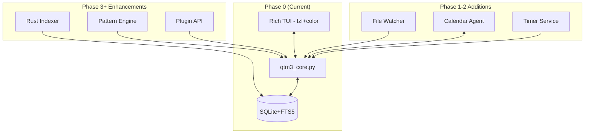

# Qwen Task Manager 3.0 - Final Unified Architecture

## Executive Summary

Combining three design iterations into a coherent whole that:
1. Ships working code immediately (Phase 0)
2. Follows structured enhancement roadmap (Phases 1-5)
3. Maintains architectural discipline while preserving UX polish

## Unified Roadmap

### Phase 0: Immediate MVP (Week 0) ✅
- Deploy existing hybrid implementation as working baseline
- Add canvas QA gates and success metrics
- Enable immediate user feedback
- **Deliverable**: `qtm3` fully functional with core features

### Phase 1: Bootstrap Enhancement (Week 1)
- Add canvas architecture boundaries (Perception locking)
- Implement file watcher with .gitignore respect
- Add timer service with `at`/`systemd-run`
- **Deliverable**: Auto-context awareness active

### Phase 2: Agent Integration (Week 2)  
- Port canvas Exchange patterns
- Add bi-directional calendar sync
- Implement dependency tracking
- **Deliverable**: Full agentic architecture

### Phase 3: Intelligence Layer (Week 3)
- Rust vector indexer for performance
- Advanced prioritization with energy optimization
- Momentum tracking algorithms
- **Deliverable**: Smart scheduling active

### Phase 4: Productivity Loops (Week 4)
- Energy-based reflection triggers
- Weekly pattern analysis
- Behavioral intervention suggestions
- **Deliverable**: Full behavioral activation

### Phase 5: Polish & Scale (Week 5)
- Performance optimization
- Plugin architecture
- Multi-user support prep
- **Deliverable**: Production-ready system

## Architecture Reconciliation



## Key Decisions

### What We Keep From Each
**Canvas Plan**:
- 5-week structured roadmap
- Agent boundaries and perception locking  
- Success metrics (<10s capture, +30% throughput)
- Risk mitigation strategies

**My Implementation**:
- Working code as Phase 0 baseline
- Rich CLI/TUI experience
- Energy tracking from day 1
- Migration tooling

**Synthesis Actions**:
1. Ship my code immediately as MVP
2. Apply canvas architecture discipline  
3. Follow canvas timeline for enhancements
4. Measure against canvas success metrics

## Success Metrics Dashboard

```python
# metrics.py - Track our KPIs
class QTMMetrics:
    def capture_time(self) -> float:
        """Measure time from prompt to DB write"""
        # Target: < 10 seconds
        
    def throughput_rate(self) -> float:
        """Tasks completed / week vs baseline"""
        # Target: +30% after 2 weeks
        
    def clarity_score(self) -> float:
        """Weekly survey 1-5"""
        # Target: >= 4/5
        
    def cpu_usage(self) -> float:
        """Average CPU during operations"""
        # Target: <= 30%
```

## Migration Strategy

```bash
# Unified migration supporting all versions
qtm3 migrate --from v1  # File-based
qtm3 migrate --from v2  # Early SQLite
qtm3 migrate --analyze  # Show what would migrate
```

## Quality Gates

### Phase 0 Exit Criteria
- [ ] Core functions work: capture, prioritize, reflect
- [ ] Metrics baseline established
- [ ] 3+ users testing daily

### Phase 1 Exit Criteria  
- [ ] File watcher stable
- [ ] Context auto-tagging accuracy >80%
- [ ] Timer integration working

### Phase 2 Exit Criteria
- [ ] Calendar sync bidirectional
- [ ] Agent boundaries enforced
- [ ] <10s capture time achieved

## Next Immediate Actions

1. **Today**: Merge energy model into Canvas schema
2. **Tomorrow**: Add metrics collection to track KPIs
3. **This Week**: Deploy Phase 0, begin Phase 1 work
4. **Next Week**: First progress review against metrics

## Technical Stack (Final)

- **Core**: Python 3.8+ (Phase 0-2), Rust (Phase 3+)
- **AI**: Qwen 3 30B with fallback to 8B
- **DB**: SQLite + FTS5 + vector extensions
- **UI**: Zsh + fzf (Phase 0), potential TUI framework (Phase 4)
- **Agents**: Shell scripts → Python services → Rust for hot paths

## Repository Structure

```
qtm3/
├── phase0/          # Current working implementation
│   ├── qtm3_core.py
│   ├── qtm3        
│   └── install.sh
├── roadmap/         # Canvas plan + iterations
│   ├── PHASES.md
│   ├── METRICS.md
│   └── QA_GATES.md
├── agents/          # Modular components (Phase 1+)
│   ├── perception/
│   ├── exchange/
│   └── reasoning/
└── tests/           # QA suite
    ├── test_metrics.py
    ├── test_capture.py
    └── benchmarks/
```

---

This unified approach ships value immediately while maintaining the architectural rigor needed for long-term success.