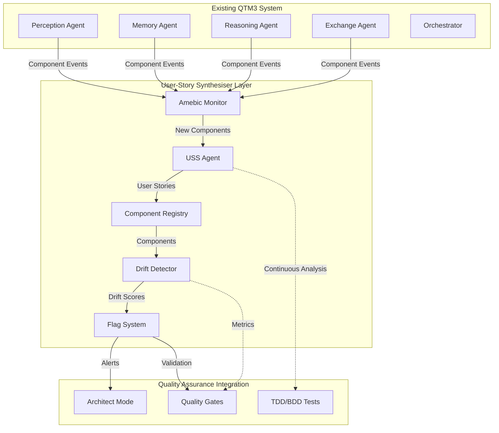

# User-Story Synthesiser Integration Architecture
*A living system for maintaining component alignment with user intent*

## 🎯 Executive Summary

The User-Story Synthesiser (USS) is designed as an **amebic layer** that continuously validates component-user story alignment within the QTM3 ecosystem. It operates as both a standalone agent and an orchestrated service that maintains the integrity of user-centered design across all system components.

### Core Value Proposition
- **Real-time Alignment**: Continuously validates that components serve their intended user stories
- **Drift Prevention**: Detects when components deviate from user intent
- **Quality Assurance**: Provides a living documentation layer that evolves with the system
- **Architectural Integrity**: Ensures all components maintain clear user value propositions

---

## 🏗️ System Architecture Overview



---

## 🧬 Component Registry System

The Component Registry serves as the central knowledge base for all first-class components and their associated user stories.

### Data Model

```python
class ComponentRegistry:
    """Central registry for component-user story mappings"""
    
    def __init__(self, db_path: Path):
        self.db_path = db_path
        self._init_registry_schema()
    
    def _init_registry_schema(self):
        """Initialize component registry tables"""
        with sqlite3.connect(self.db_path) as conn:
            conn.executescript("""
                CREATE TABLE IF NOT EXISTS components (
                    id TEXT PRIMARY KEY,
                    name TEXT NOT NULL,
                    type TEXT NOT NULL,  -- agent, module, service
                    file_path TEXT,
                    created_at TIMESTAMP DEFAULT CURRENT_TIMESTAMP,
                    last_analyzed TIMESTAMP,
                    status TEXT DEFAULT 'active'  -- active, deprecated, flagged
                );
                
                CREATE TABLE IF NOT EXISTS user_stories (
                    id TEXT PRIMARY KEY,
                    component_id TEXT,
                    user_story TEXT NOT NULL,
                    engagement TEXT CHECK(engagement IN ('direct', 'proxy')),
                    primitive_value TEXT NOT NULL,
                    expression TEXT NOT NULL,
                    confidence_score REAL DEFAULT 0.0,
                    created_at TIMESTAMP DEFAULT CURRENT_TIMESTAMP,
                    FOREIGN KEY (component_id) REFERENCES components (id)
                );
                
                CREATE TABLE IF NOT EXISTS touch_points (
                    id TEXT PRIMARY KEY,
                    user_story_id TEXT,
                    touch_point TEXT NOT NULL,
                    touch_type TEXT,  -- input, output, interface
                    FOREIGN KEY (user_story_id) REFERENCES user_stories (id)
                );
                
                CREATE TABLE IF NOT EXISTS drift_metrics (
                    id TEXT PRIMARY KEY,
                    component_id TEXT,
                    drift_score REAL NOT NULL,
                    drift_type TEXT,  -- implementation, interface, purpose
                    measured_at TIMESTAMP DEFAULT CURRENT_TIMESTAMP,
                    details TEXT,  -- JSON details
                    FOREIGN KEY (component_id) REFERENCES components (id)
                );
            """)
```

### Registry Operations

```python
class ComponentRegistryOperations:
    """Core operations for component registry management"""
    
    def register_component(self, component_info: Dict) -> str:
        """Register a new component for USS analysis"""
        component_id = f"comp_{uuid.uuid4().hex[:8]}"
        
        with sqlite3.connect(self.db_path) as conn:
            conn.execute("""
                INSERT INTO components (id, name, type, file_path)
                VALUES (?, ?, ?, ?)
            """, (component_id, component_info['name'], 
                  component_info['type'], component_info.get('file_path')))
        
        # Trigger USS analysis
        self._schedule_uss_analysis(component_id)
        return component_id
    
    def store_user_story(self, component_id: str, uss_output: Dict) -> str:
        """Store USS analysis results"""
        story_id = f"story_{uuid.uuid4().hex[:8]}"
        
        with sqlite3.connect(self.db_path) as conn:
            # Store main user story
            conn.execute("""
                INSERT INTO user_stories 
                (id, component_id, user_story, engagement, primitive_value, expression)
                VALUES (?, ?, ?, ?, ?, ?)
            """, (story_id, component_id, uss_output['user_story'],
                  uss_output['engagement'], uss_output['primitive_value'],
                  uss_output['expression']))
            
            # Store touch points
            for touch_point in uss_output['touch_points']:
                conn.execute("""
                    INSERT INTO touch_points (id, user_story_id, touch_point)
                    VALUES (?, ?, ?)
                """, (f"tp_{uuid.uuid4().hex[:8]}", story_id, touch_point))
        
        return story_id
    
    def get_component_story(self, component_id: str) -> Optional[Dict]:
        """Retrieve current user story for component"""
        with sqlite3.connect(self.db_path) as conn:
            result = conn.execute("""
                SELECT us.*, GROUP_CONCAT(tp.touch_point) as touch_points
                FROM user_stories us
                LEFT JOIN touch_points tp ON us.id = tp.user_story_id
                WHERE us.component_id = ?
                ORDER BY us.created_at DESC
                LIMIT 1
            """, (component_id,)).fetchone()
        
        if result:
            return {
                'user_story': result[2],
                'engagement': result[3],
                'primitive_value': result[4],
                'expression': result[5],
                'touch_points': result[7].split(',') if result[7] else []
            }
        return None
```

---

## 🔄 Amebic Layer Architecture

The Amebic Monitor operates as a continuous background process that detects component changes and triggers USS analysis automatically.

### Amebic Monitor Agent

```python
class AmebicMonitor(Agent):
    """Continuously monitors system for component changes"""
    
    def __init__(self):
        super().__init__("amebic_monitor")
        self.component_registry = ComponentRegistry(self.db_path)
        self.file_watcher = ComponentFileWatcher()
        self.code_analyzer = CodeAnalyzer()
        self.uss_client = USSClient()
        self.analysis_queue = asyncio.Queue()
    
    def handle_message(self, message: Dict[str, Any]) -> Dict[str, Any]:
        """Handle component change notifications"""
        action = message.get("action")
        
        if action == "component_changed":
            return self._handle_component_change(message.get("component_info"))
        elif action == "new_component_detected":
            return self._handle_new_component(message.get("component_path"))
        elif action == "get_component_status":
            return self._get_component_status(message.get("component_id"))
        else:
            return {"error": f"Unknown action: {action}"}
    
    def _handle_component_change(self, component_info: Dict) -> Dict[str, Any]:
        """Process component modification events"""
        component_id = component_info.get('id')
        
        # Queue for analysis if significant change
        if self._is_significant_change(component_info):
            asyncio.create_task(self._queue_uss_analysis(component_id))
            return {"queued_for_analysis": True, "component_id": component_id}
        
        return {"queued_for_analysis": False, "reason": "insignificant_change"}
    
    async def _queue_uss_analysis(self, component_id: str):
        """Queue component for USS analysis"""
        await self.analysis_queue.put({
            'component_id': component_id,
            'analysis_type': 'full_synthesis',
            'timestamp': datetime.now().isoformat()
        })
    
    def _is_significant_change(self, component_info: Dict) -> bool:
        """Determine if change warrants USS re-analysis"""
        # Check for significant code changes
        if component_info.get('lines_changed', 0) > 10:
            return True
        
        # Check for interface changes
        if component_info.get('interface_modified', False):
            return True
        
        # Check for new public methods
        if component_info.get('new_public_methods', []):
            return True
        
        return False
```

### Component File Watcher

```python
class ComponentFileWatcher:
    """Watches for file system changes in component files"""
    
    def __init__(self, watch_patterns: List[str] = None):
        self.watch_patterns = watch_patterns or [
            "*.py", "*.js", "*.ts", "*.md", "*.yml", "*.yaml"
        ]
        self.observer = Observer()
        self.handlers = {}
    
    def start_watching(self, base_path: Path, callback: Callable):
        """Start watching for component changes"""
        handler = ComponentChangeHandler(
            patterns=self.watch_patterns,
            callback=callback
        )
        
        self.observer.schedule(handler, str(base_path), recursive=True)
        self.observer.start()
    
    def stop_watching(self):
        """Stop file watching"""
        self.observer.stop()
        self.observer.join()

class ComponentChangeHandler(PatternMatchingEventHandler):
    """Handle file change events for components"""
    
    def __init__(self, patterns: List[str], callback: Callable):
        super().__init__(patterns=patterns)
        self.callback = callback
        self.code_analyzer = CodeAnalyzer()
    
    def on_modified(self, event):
        """Handle file modification events"""
        if not event.is_directory:
            component_info = self.code_analyzer.analyze_file_change(
                Path(event.src_path)
            )
            self.callback(component_info)
```

---

## 📊 Drift Detection System

The Drift Detection System continuously monitors components for alignment with their established user stories.

### Drift Detection Engine

```python
class DriftDetector:
    """Detects when components drift from their user stories"""
    
    def __init__(self, registry: ComponentRegistry):
        self.registry = registry
        self.code_analyzer = CodeAnalyzer()
        self.semantic_analyzer = SemanticAnalyzer()
        self.interface_analyzer = InterfaceAnalyzer()
    
    def calculate_drift_score(self, component_id: str) -> DriftScore:
        """Calculate comprehensive drift score for component"""
        component = self.registry.get_component(component_id)
        user_story = self.registry.get_component_story(component_id)
        
        if not component or not user_story:
            return DriftScore(score=1.0, reason="missing_data")
        
        # Analyze different drift dimensions
        implementation_drift = self._analyze_implementation_drift(component, user_story)
        interface_drift = self._analyze_interface_drift(component, user_story)
        purpose_drift = self._analyze_purpose_drift(component, user_story)
        
        # Weighted composite score
        composite_score = (
            implementation_drift.score * 0.4 +
            interface_drift.score * 0.3 +
            purpose_drift.score * 0.3
        )
        
        return DriftScore(
            score=composite_score,
            implementation=implementation_drift,
            interface=interface_drift,
            purpose=purpose_drift,
            component_id=component_id,
            measured_at=datetime.now()
        )
    
    def _analyze_implementation_drift(self, component: Dict, user_story: Dict) -> DriftDimension:
        """Analyze if implementation still serves the user story"""
        # Extract current functionality
        current_functions = self.code_analyzer.extract_functions(component['file_path'])
        
        # Compare with expected touch points
        expected_touchpoints = user_story['touch_points']
        actual_touchpoints = self.interface_analyzer.extract_touchpoints(current_functions)
        
        # Calculate alignment score
        touchpoint_overlap = len(set(expected_touchpoints) & set(actual_touchpoints))
        total_touchpoints = len(set(expected_touchpoints) | set(actual_touchpoints))
        
        alignment_score = touchpoint_overlap / max(total_touchpoints, 1)
        drift_score = 1.0 - alignment_score
        
        return DriftDimension(
            score=drift_score,
            type="implementation",
            details={
                "expected_touchpoints": expected_touchpoints,
                "actual_touchpoints": actual_touchpoints,
                "alignment_score": alignment_score
            }
        )
    
    def _analyze_interface_drift(self, component: Dict, user_story: Dict) -> DriftDimension:
        """Analyze if public interface still matches user expectations"""
        # Check if engagement type is still appropriate
        current_interface = self.interface_analyzer.analyze_interface(component['file_path'])
        expected_engagement = user_story['engagement']
        
        # Direct engagement should have simple, user-facing interfaces
        # Proxy engagement should have developer-facing interfaces
        interface_complexity = current_interface.complexity_score()
        
        if expected_engagement == 'direct' and interface_complexity > 0.7:
            drift_score = 0.8  # High drift - direct interface too complex
        elif expected_engagement == 'proxy' and interface_complexity < 0.3:
            drift_score = 0.6  # Medium drift - proxy interface too simple
        else:
            drift_score = 0.1  # Low drift - interface matches engagement
        
        return DriftDimension(
            score=drift_score,
            type="interface",
            details={
                "expected_engagement": expected_engagement,
                "interface_complexity": interface_complexity,
                "interface_analysis": current_interface.to_dict()
            }
        )
    
    def _analyze_purpose_drift(self, component: Dict, user_story: Dict) -> DriftDimension:
        """Analyze if component purpose still aligns with primitive value"""
        # Use semantic analysis to compare current purpose with primitive value
        current_purpose = self.semantic_analyzer.extract_purpose(component['file_path'])
        expected_value = user_story['primitive_value']
        
        # Semantic similarity between current purpose and expected value
        similarity_score = self.semantic_analyzer.calculate_similarity(
            current_purpose, expected_value
        )
        
        drift_score = 1.0 - similarity_score
        
        return DriftDimension(
            score=drift_score,
            type="purpose",
            details={
                "current_purpose": current_purpose,
                "expected_value": expected_value,
                "similarity_score": similarity_score
            }
        )

@dataclass
class DriftScore:
    """Comprehensive drift score for a component"""
    score: float  # 0.0 = no drift, 1.0 = complete drift
    implementation: DriftDimension
    interface: DriftDimension  
    purpose: DriftDimension
    component_id: str
    measured_at: datetime
    
    def is_significant_drift(self, threshold: float = 0.6) -> bool:
        """Check if drift exceeds threshold requiring attention"""
        return self.score > threshold
    
    def get_drift_summary(self) -> str:
        """Human-readable drift summary"""
        if self.score < 0.3:
            return f"✅ Component aligned with user story (drift: {self.score:.2f})"
        elif self.score < 0.6:
            return f"⚠️ Minor drift detected (drift: {self.score:.2f})"
        else:
            return f"🚨 Significant drift detected (drift: {self.score:.2f})"

@dataclass  
class DriftDimension:
    """Individual dimension of drift analysis"""
    score: float
    type: str  # implementation, interface, purpose
    details: Dict[str, Any]
```

---

## 🚩 Flag Tool System

The Flag System provides validation mechanisms and alerts when components require architectural review.

### Flag System Implementation

```python
class FlagSystem:
    """Validation and alerting system for component drift"""
    
    def __init__(self, registry: ComponentRegistry, drift_detector: DriftDetector):
        self.registry = registry
        self.drift_detector = drift_detector
        self.flag_thresholds = {
            'minor_drift': 0.3,
            'significant_drift': 0.6,
            'critical_drift': 0.8
        }
        self.alert_handlers = []
    
    def register_alert_handler(self, handler: Callable):
        """Register handler for drift alerts"""
        self.alert_handlers.append(handler)
    
    def evaluate_component(self, component_id: str) -> FlagResult:
        """Evaluate component and flag if necessary"""
        drift_score = self.drift_detector.calculate_drift_score(component_id)
        
        # Determine flag level
        flag_level = self._determine_flag_level(drift_score.score)
        
        # Create flag result
        flag_result = FlagResult(
            component_id=component_id,
            flag_level=flag_level,
            drift_score=drift_score,
            requires_review=flag_level in ['significant', 'critical'],
            timestamp=datetime.now()
        )
        
        # Store flag result
        self._store_flag_result(flag_result)
        
        # Send alerts if necessary
        if flag_result.requires_review:
            self._send_alerts(flag_result)
        
        return flag_result
    
    def _determine_flag_level(self, drift_score: float) -> str:
        """Determine appropriate flag level based on drift score"""
        if drift_score >= self.flag_thresholds['critical_drift']:
            return 'critical'
        elif drift_score >= self.flag_thresholds['significant_drift']:
            return 'significant'  
        elif drift_score >= self.flag_thresholds['minor_drift']:
            return 'minor'
        else:
            return 'none'
    
    def _send_alerts(self, flag_result: FlagResult):
        """Send alerts to registered handlers"""
        for handler in self.alert_handlers:
            try:
                handler(flag_result)
            except Exception as e:
                logging.error(f"Alert handler failed: {e}")
    
    def _store_flag_result(self, flag_result: FlagResult):
        """Store flag result in database"""
        with sqlite3.connect(self.registry.db_path) as conn:
            conn.execute("""
                INSERT INTO component_flags 
                (component_id, flag_level, drift_score, details, flagged_at)
                VALUES (?, ?, ?, ?, ?)
            """, (
                flag_result.component_id,
                flag_result.flag_level,
                flag_result.drift_score.score,
                json.dumps(flag_result.to_dict()),
                flag_result.timestamp.isoformat()
            ))

@dataclass
class FlagResult:
    """Result of flag evaluation for a component"""
    component_id: str
    flag_level: str  # none, minor, significant, critical
    drift_score: DriftScore
    requires_review: bool
    timestamp: datetime
    
    def to_dict(self) -> Dict:
        """Convert to dictionary for storage"""
        return {
            'component_id': self.component_id,
            'flag_level': self.flag_level,
            'drift_score': self.drift_score.score,
            'requires_review': self.requires_review,
            'timestamp': self.timestamp.isoformat(),
            'drift_details': {
                'implementation': self.drift_score.implementation.details,
                'interface': self.drift_score.interface.details,
                'purpose': self.drift_score.purpose.details
            }
        }
```

### Alert Handlers

```python
class ArchitectAlertHandler:
    """Sends alerts to Architect mode for review"""
    
    def __init__(self, orchestrator):
        self.orchestrator = orchestrator
    
    def __call__(self, flag_result: FlagResult):
        """Handle flag alert by notifying Architect"""
        message = {
            "type": "component_drift_alert",
            "component_id": flag_result.component_id,
            "flag_level": flag_result.flag_level,
            "drift_summary": flag_result.drift_score.get_drift_summary(),
            "review_required": flag_result.requires_review,
            "details": flag_result.to_dict()
        }
        
        # Send to Architect mode via orchestrator
        self.orchestrator.send_message("architect", {
            "action": "review_component_drift",
            "alert_data": message
        })

class QualityGateAlertHandler:
    """Integrates with quality gate system"""
    
    def __init__(self, quality_gates):
        self.quality_gates = quality_gates
    
    def __call__(self, flag_result: FlagResult):
        """Handle flag alert by updating quality gates"""
        if flag_result.flag_level == 'critical':
            # Block deployment if critical drift detected
            self.quality_gates.block_deployment(
                reason=f"Critical drift in component {flag_result.component_id}",
                details=flag_result.to_dict()
            )

class TelemetryAlertHandler:
    """Reports drift metrics to telemetry system"""
    
    def __init__(self, telemetry):
        self.telemetry = telemetry
    
    def __call__(self, flag_result: FlagResult):
        """Handle flag alert by recording metrics"""
        self.telemetry.record_metric(
            "component_drift_detected",
            value=flag_result.drift_score.score,
            tags={
                "component_id": flag_result.component_id,
                "flag_level": flag_result.flag_level,
                "drift_type": flag_result.drift_score.implementation.type
            }
        )
```

---

## 🎭 User-Story Synthesiser Agent

The USS Agent is the core component responsible for analyzing components and generating user stories.

### USS Agent Implementation

```python
class UserStorySynthesiserAgent(Agent):
    """Agent responsible for generating and maintaining user stories"""
    
    def __init__(self):
        super().__init__("user_story_synthesiser")
        self.component_analyzer = ComponentAnalyzer()
        self.story_generator = StoryGenerator()
        self.quality_assessor = StoryQualityAssessor()
    
    def handle_message(self, message: Dict[str, Any]) -> Dict[str, Any]:
        """Handle USS requests"""
        action = message.get("action")
        
        if action == "synthesize_story":
            return self._synthesize_component_story(message.get("component_info"))
        elif action == "update_story":
            return self._update_existing_story(message.get("component_id"), message.get("changes"))
        elif action == "validate_story":
            return self._validate_story_quality(message.get("story_data"))
        else:
            return {"error": f"Unknown action: {action}"}
    
    def _synthesize_component_story(self, component_info: Dict) -> Dict[str, Any]:
        """Generate user story for component"""
        # Analyze component structure and purpose
        analysis = self.component_analyzer.analyze_component(component_info)
        
        # Generate user story using AI reasoning
        story_data = self.story_generator.generate_story(analysis)
        
        # Assess quality of generated story
        quality_score = self.quality_assessor.assess_quality(story_data)
        
        # Package result
        result = {
            "component": component_info['name'],
            "user_story": story_data['user_story'],
            "engagement": story_data['engagement'],
            "touch_points": story_data['touch_points'],
            "primitive_value": story_data['primitive_value'],
            "expression": story_data['expression'],
            "quality_score": quality_score.overall_score,
            "confidence": quality_score.confidence,
            "analysis_metadata": {
                "analyzed_at": datetime.now().isoformat(),
                "analyzer_version": "1.0",
                "component_analysis": analysis.to_dict()
            }
        }
        
        return result

class ComponentAnalyzer:
    """Analyzes components to understand their purpose and interfaces"""
    
    def analyze_component(self, component_info: Dict) -> ComponentAnalysis:
        """Comprehensive component analysis"""
        file_path = Path(component_info.get('file_path', ''))
        
        # Extract structural information
        structure = self._analyze_structure(file_path)
        
        # Extract behavioral patterns
        behavior = self._analyze_behavior(file_path)
        
        # Extract user interaction patterns
        interactions = self._analyze_interactions(file_path)
        
        # Extract dependencies and relationships
        relationships = self._analyze_relationships(file_path)
        
        return ComponentAnalysis(
            structure=structure,
            behavior=behavior,
            interactions=interactions,
            relationships=relationships,
            component_info=component_info
        )
    
    def _analyze_structure(self, file_path: Path) -> Dict:
        """Analyze component's structural elements"""
        # Parse code to extract classes, functions, interfaces
        return {
            "classes": [],
            "functions": [],
            "interfaces": [],
            "data_structures": []
        }
    
    def _analyze_behavior(self, file_path: Path) -> Dict:
        """Analyze component's behavioral patterns"""
        # Identify key behaviors and workflows
        return {
            "primary_behaviors": [],
            "side_effects": [],
            "state_changes": [],
            "event_handling": []
        }
    
    def _analyze_interactions(self, file_path: Path) -> Dict:
        """Analyze how users interact with component"""
        # Identify user-facing interfaces and touch points
        return {
            "input_methods": [],
            "output_formats": [],
            "user_touchpoints": [],
            "interaction_patterns": []
        }

class StoryGenerator:
    """Generates user stories using AI reasoning"""
    
    def __init__(self):
        self.reasoning_agent = ReasoningAgent()
    
    def generate_story(self, analysis: ComponentAnalysis) -> Dict[str, Any]:
        """Generate user story from component analysis"""
        # Prepare context for AI reasoning
        context = self._prepare_context(analysis)
        
        # Generate story using reasoning agent
        story_prompt = self._build_story_prompt(context)
        ai_response = self.reasoning_agent.send_message("reasoning", {
            "action": "generate_user_story",
            "prompt": story_prompt,
            "context": context
        })
        
        # Parse and structure response
        return self._parse_story_response(ai_response)
    
    def _build_story_prompt(self, context: Dict) -> str:
        """Build prompt for user story generation"""
        return f"""
        Analyze this component and generate a user story following this exact JSON format:
        
        {{
            "component": "{context['component_name']}",
            "user_story": "As a [user] I want [goal] so that [benefit]",
            "engagement": "direct|proxy",
            "touch_points": ["concrete I/O surfaces"],
            "primitive_value": "one-line essence",
            "expression": "how value appears physically"
        }}
        
        Component Analysis:
        - Structure: {context['structure_summary']}
        - Behavior: {context['behavior_summary']}
        - Interactions: {context['interaction_summary']}
        
        Focus on identifying the core user value and how it manifests in the system.
        """

class StoryQualityAssessor:
    """Assesses quality of generated user stories"""
    
    def assess_quality(self, story_data: Dict) -> QualityScore:
        """Comprehensive quality assessment"""
        # Check story format compliance
        format_score = self._assess_format(story_data)
        
        # Check story clarity and specificity
        clarity_score = self._assess_clarity(story_data)
        
        # Check value proposition strength
        value_score = self._assess_value_proposition(story_data)
        
        # Check touchpoint relevance
        touchpoint_score = self._assess_touchpoints(story_data)
        
        overall_score = (
            format_score * 0.2 +
            clarity_score * 0.3 +
            value_score * 0.3 +
            touchpoint_score * 0.2
        )
        
        return QualityScore(
            overall_score=overall_score,
            format_score=format_score,
            clarity_score=clarity_score,
            value_score=value_score,
            touchpoint_score=touchpoint_score,
            confidence=min(overall_score, 0.95)  # Cap confidence
        )
```

---

## 🔌 Integration Points

### Integration with Existing Agents

```python
class USSIntegration:
    """Integration layer with existing QTM3 agents"""
    
    def __init__(self, orchestrator: AgentOrchestrator):
        self.orchestrator = orchestrator
        self.uss_agent = UserStorySynthesiserAgent()
        self.amebic_monitor = AmebicMonitor()
        self.flag_system = FlagSystem()
        
        # Register USS with orchestrator
        self.orchestrator.agents["uss"] = self.uss_agent
        self.orchestrator.agents["amebic_monitor"] = self.amebic_monitor
        
        # Set up alert handlers
        self._setup_alert_handlers()
    
    def _setup_alert_handlers(self):
        """Configure alert handlers for flag system"""
        # Alert architect mode for significant drift
        architect_handler = ArchitectAlertHandler(self.orchestrator)
        self.flag_system.register_alert_handler(architect_handler)
        
        # Integrate with quality gates
        quality_gate_handler = QualityGateAlertHandler(
            self.orchestrator.quality_gates
        )
        self.flag_system.register_alert_handler(quality_gate_handler)
        
        # Record telemetry data
        telemetry_handler = TelemetryAlertHandler(
            self.orchestrator.telemetry
        )
        self.flag_system.register_alert_handler(telemetry_handler)
    
    def integrate_with_perception(self):
        """Hook into Perception agent for component detection"""
        # Modify Perception agent to notify USS of new components
        original_scan_files = self.orchestrator.agents["perception"]._scan_files
        
        def uss_aware_scan_files(path: str):
            result = original_scan_files(path)
            
            # Check for new components
            for file_info in result.get("files", []):
                if self._is_component_file(file_info):
                    self.amebic_monitor.send_message("amebic_monitor", {
                        "action": "new_component_detected",
                        "component_path": file_info.get("path")
                    })
            
            return result
        
        self.orchestrator.agents["perception"]._scan_files = uss_aware_scan_files
    
    def integrate_with_quality_gates(self):
        """Integrate USS metrics with existing quality gates"""
        # Add USS quality checks to phase gates
        original_phase_gate = self.orchestrator.quality_gates.phase_0_gate
        
        def uss_enhanced_phase_gate():
            passed, issues = original_phase_gate()
            
            # Add USS-specific checks
            uss_issues = self._check_uss_quality_gates()
            issues.extend(uss_issues)
            
            uss_passed = len(uss_issues) == 0
            return passed and uss_passed, issues
        
        self.orchestrator.quality_gates.phase_0_gate = uss_enhanced_phase_gate
    
    def _check_uss_quality_gates(self) -> List[str]:
        """Check USS-specific quality requirements"""
        issues = []
        
        # Check component coverage
        total_components = self.uss_agent.registry.count_components()
        analyzed_components = self.uss_agent.registry.count_analyzed_components()
        
        if total_components > 0:
            coverage = analyzed_components / total_components
            if coverage < 0.8:
                issues.append(f"USS coverage {coverage:.1%} below 80% threshold")
        
        # Check drift levels
        high_drift_components = self.uss_agent.registry.count_high_drift_components()
        if high_drift_components > 0:
            issues.append(f"{high_drift_components} components have significant drift")
        
        return issues
```

### Integration with TDD/BDD Strategy

```python
class USSTestIntegration:
    """Integration with existing TDD/BDD framework"""
    
    @pytest.mark.uss
    def test_user_story_synthesis_quality(self):
        """Verify USS generates high-quality user stories"""
        # Test component
        test_component = {
            'name': 'PerceptionAgent',
            'type': 'agent',
            'file_path': 'agents.py'
        }
        
        # Generate user story
        uss_result = self.uss_agent.synthesize_story(test_component)
        
        # Validate story quality
        assert uss_result['quality_score'] > 0.8
        assert "As a" in uss_result['user_story']
        assert "I want" in uss_result['user_story']
        assert "so that" in uss_result['user_story']
        assert uss_result['engagement'] in ['direct', 'proxy']
        assert len(uss_result['touch_points']) > 0
        assert len(uss_result['primitive_value']) > 0
    
    @pytest.mark.uss
    @pytest.mark.behavioral
    def test_drift_detection_prevents_component_degradation(self):
        """Verify drift detection maintains component quality"""
        # Register component with story
        component_id = self.registry.register_component({
            'name': 'TestComponent',
            'type': 'module'
        })
        
        # Simulate component drift
        self._simulate_component_drift(component_id)
        
        # Check drift detection
        drift_score = self.drift_detector.calculate_drift_score(component_id)
        
        assert drift_score.is_significant_drift()
        assert drift_score.score > 0.6
    
    @pytest.mark.uss
    @pytest.mark.integration
    def test_flag_system_alerts_architect_on_drift(self):
        """Verify flag system properly alerts for review"""
        # Create component with high drift
        component_id = self._create_high_drift_component()
        
        # Evaluate component
        flag_result = self.flag_system.evaluate_component(component_id)
        
        # Verify alert sent
        assert flag_result.requires_review
        assert flag_result.flag_level in ['significant', 'critical']
        
        # Verify architect notified
        architect_messages = self.mock_orchestrator.get_messages_for("architect")
        assert any(msg['action'] == 'review_component_drift' 
                  for msg in architect_messages)
```

---

## 📈 Data Models and Schemas

### Complete Database Schema

```sql
-- Component Registry Schema
CREATE TABLE IF NOT EXISTS components (
    id TEXT PRIMARY KEY,
    name TEXT NOT NULL,
    type TEXT NOT NULL CHECK(type IN ('agent', 'module', 'service', 'utility')),
    file_path TEXT,
    created_at TIMESTAMP DEFAULT CURRENT_TIMESTAMP,
    last_analyzed TIMESTAMP,
    status TEXT DEFAULT 'active' CHECK(status IN ('active', 'deprecated', 'flagged', 'archived'))
);

CREATE TABLE IF NOT EXISTS user_stories (
    id TEXT PRIMARY KEY,
    component_id TEXT NOT NULL,
    user_story TEXT NOT NULL,
    engagement TEXT NOT NULL CHECK(engagement IN ('direct', 'proxy')),
    primitive_value TEXT NOT NULL,
    expression TEXT NOT NULL,
    confidence_score REAL DEFAULT 0.0 CHECK(confidence_score >= 0.0 AND confidence_score <= 1.0),
    quality_score REAL DEFAULT 0.0 CHECK(quality_score >= 0.0 AND quality_score <= 1.0),
    created_at TIMESTAMP DEFAULT CURRENT_TIMESTAMP,
    updated_at TIMESTAMP DEFAULT CURRENT_TIMESTAMP,
    FOREIGN KEY (component_id) REFERENCES components (id) ON DELETE CASCADE
);

CREATE TABLE IF NOT EXISTS touch_points (
    id TEXT PRIMARY KEY,
    user_story_id TEXT NOT NULL,
    touch_point TEXT NOT NULL,
    touch_type TEXT CHECK(touch_type IN ('input', 'output', 'interface', 'event')),
    created_at TIMESTAMP DEFAULT CURRENT_TIMESTAMP,
    FOREIGN KEY (user_story_id) REFERENCES user_stories (id) ON DELETE CASCADE
);

CREATE TABLE IF NOT EXISTS drift_metrics (
    id TEXT PRIMARY KEY,
    component_id TEXT NOT NULL,
    drift_score REAL NOT NULL CHECK(drift_score >= 0.0 AND drift_score <= 1.0),
    drift_type TEXT NOT NULL CHECK(drift_type IN ('implementation', 'interface', 'purpose', 'composite')),
    measured_at TIMESTAMP DEFAULT CURRENT_TIMESTAMP,
    details TEXT, -- JSON details
    FOREIGN KEY (component_id) REFERENCES components (id) ON DELETE CASCADE
);

CREATE TABLE IF NOT EXISTS component_flags (
    id TEXT PRIMARY KEY,
    component_id TEXT NOT NULL,
    flag_level TEXT NOT NULL CHECK(flag_level IN ('none', 'minor', 'significant', 'critical')),
    drift_score REAL NOT NULL,
    details TEXT, -- JSON details
    flagged_at TIMESTAMP DEFAULT CURRENT_TIMESTAMP,
    resolved_at TIMESTAMP,
    resolved_by TEXT,
    FOREIGN KEY (component_id) REFERENCES components (id) ON DELETE CASCADE
);

CREATE TABLE IF NOT EXISTS uss_analysis_log (
    id TEXT PRIMARY KEY,
    component_id TEXT NOT NULL,
    analysis_type TEXT NOT NULL CHECK(analysis_type IN ('initial', 'update', 'drift_check', 'scheduled')),
    started_at TIMESTAMP DEFAULT CURRENT_TIMESTAMP,
    completed_at TIMESTAMP,
    status TEXT DEFAULT 'running' CHECK(status IN ('running', 'completed', 'failed')),
    result_data TEXT, -- JSON result
    error_message TEXT,
    FOREIGN KEY (component_id) REFERENCES components (id) ON DELETE CASCADE
);

-- Indexes for performance
CREATE INDEX IF NOT EXISTS idx_components_type ON components(type);
CREATE INDEX IF NOT EXISTS idx_components_status ON components(status);
CREATE INDEX IF NOT EXISTS idx_user_stories_component ON user_stories(component_id);
CREATE INDEX IF NOT EXISTS idx_drift_metrics_component ON drift_metrics(component_id);
CREATE INDEX IF NOT EXISTS idx_drift_metrics_score ON drift_metrics(drift_score);
CREATE INDEX IF NOT EXISTS idx_flags_component ON component_flags(component_id);
CREATE INDEX IF NOT EXISTS idx_flags_level ON component_flags(flag_level);
CREATE INDEX IF NOT EXISTS idx_analysis_log_component ON uss_analysis_log(component_id);
```

---

## 🚀 Implementation Phases

### Phase 1: Foundation (Week 1)
**Goal: Basic USS infrastructure**

- [ ] Implement ComponentRegistry with basic CRUD operations
- [ ] Create UserStorySynthesiserAgent with simple analysis
- [ ] Build basic file watching infrastructure
- [ ] Set up database schema and migrations
- [ ] Create unit tests for core components

**Success Criteria:**
- USS can analyze simple components and generate basic user stories
- Component registry can store and retrieve component data
- File watcher detects component changes

### Phase 2: Amebic Layer (Week 2)
**Goal: Continuous monitoring and analysis**

- [ ] Implement AmebicMonitor with file watching
- [ ] Add automatic component detection and registration
- [ ] Build ComponentAnalyzer for structural analysis
- [ ] Create StoryGenerator with AI integration
- [ ] Add integration with existing Perception agent

**Success Criteria:**
- System automatically detects new components
- USS generates quality user stories for all component types
- Amebic layer operates continuously without intervention

### Phase 3: Drift Detection (Week 3)
**Goal: Component alignment monitoring**

- [ ] Implement DriftDetector with multi-dimensional analysis
- [ ] Build semantic analysis capabilities
- [ ] Create interface analysis tools
- [ ] Add drift scoring algorithms
- [ ] Implement continuous drift monitoring

**Success Criteria:**
- System accurately detects component drift
- Drift scores correlate with actual alignment issues
- Monitoring operates in real-time

### Phase 4: Flag System (Week 4)
**Goal: Alert and validation infrastructure**

- [ ] Implement FlagSystem with multiple alert handlers
- [ ] Create integration with Architect mode
- [ ] Add quality gate integration
- [ ] Build telemetry and metrics collection
- [ ] Create flag resolution workflows

**Success Criteria:**
- System alerts appropriate stakeholders for drift
- Quality gates block deployment on critical drift
- Metrics provide visibility into system health

### Phase 5: Polish & Integration (Week 5)
**Goal: Production readiness**

- [ ] Add comprehensive error handling and recovery
- [ ] Implement performance optimizations
- [ ] Create administrative interfaces
- [ ] Add advanced analytics and reporting
- [ ] Complete integration testing

**Success Criteria:**
- System operates reliably in production
- Performance meets target requirements
- All quality gates and tests pass

---

## 🎯 Success Metrics

### Operational Metrics
- **Component Coverage**: >95% of components have associated user stories
- **Analysis Latency**: <30 seconds for component analysis
- **Drift Detection Accuracy**: >90% correlation with human assessment
- **Alert Precision**: <5% false positive rate for flags

### Quality Metrics
- **Story Quality Score**: >0.8 average quality for generated stories
- **User Story Compliance**: 100% stories follow required format
- **Drift Prevention**: <10% of components develop significant drift
- **Review Resolution**: >80% of flagged components resolved within 48 hours

### Integration Metrics
- **System Uptime**: >99.5% availability for USS layer
- **Agent Communication**: <100ms latency for inter-agent messages
- **Quality Gate Integration**: 0 deployment blocks due to USS failures
- **TDD/BDD Coverage**: >90% test coverage for USS components

---

This architecture creates a living, breathing system that continuously validates component-user story alignment while integrating seamlessly with the existing QTM3 ecosystem. The USS becomes an integral part of the quality assurance process, ensuring that every component serves clear user value and maintaining architectural integrity across the entire system.